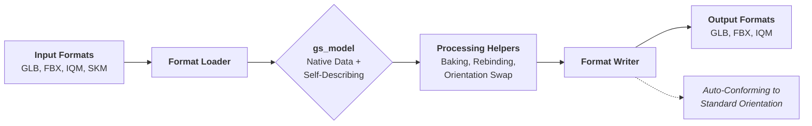

# GameSkelIO

GameSkelIO is a high-performance C-compatible library designed for **3D skeletal model and animation transcoding**. It serves as a middleware layer between modern 3D formats (like glTF and FBX) and legacy or specialized game engine formats (like IQM and SKM).

## Core Architecture
GameSkelIO has evolved from a single-standard library to a flexible, automated transcoding engine.

- **Format Loaders**: Loaders (IQM, SKM, GLB, FBX) read data in its native format and convert it into the common `gs_model` format.
- **Format Writers**: Writers convert the `gs_model` data into the target format, automatically conforming the orientation to the format's native standard (e.g., Y-Up for GLB, Z-Up for IQM).
- **Generic Skeletal Model (`gs_model`)**: A unified skeletal model definition featuring time-based animations and self-identifying orientation and winding fields.
- **Transformation & Processing Helpers**: Internal tools to perform manual operations on `gs_model`, such as orientation and winding order swaps or baking time-based animations into frame-based buffers.
- **Embedded Texture Support**: The root `gs_model` struct includes a `textures` array containing raw binary image data (PNG, JPG) extracted from GLB or FBX containers.
- **Transparent C API**: The public C functions work on temporary C++ copies, ensuring that the user's original `gs_model*` is never mutated by a write operation.

## Transcoding Workflow



## Key Features

- **Memory-First API**: All loaders and writers operate primarily on memory buffers, making it ideal for custom engine asset pipelines.
- **PBR & Legacy Materials**: Full support for Metallic-Roughness workflows with automated fallbacks and conversion from Legacy (Phong/Lambert) shaders.
- **Embedded Texture Retrieval**: Access raw image bytes (PNG, JPG) stored within GLB/FBX containers via the `gsk_get_embedded_texture` API.
- **Advanced Orientation API**: Perform zero-copy, in-place orientation and winding order swaps on loaded models.
- **On-Demand Animation Baking**: Convert sparse, time-based animation tracks into dense, frame-based buffers for legacy engines.

## Format Support

| Format | Read | Write | Standard Orientation | Notes |
| :--- | :---: | :---: | :--- | :--- |
| **GLB / glTF** | ✅ | ✅ | Y-Up, CCW | Strictly writes PBR Metallic-Roughness. |
| **FBX (Binary)** | ✅ | ✅ | Y-Up, CCW | Supports PBR shaders and custom orientation detection. |
| **IQM** | ✅ | ✅ | Z-Up, CW | Automated conversion from any source space. |
| **SKM / SKP** | ✅ | ❌ | Z-Up, CW | Legacy format; upgraded to PBR on GLB export. |

---

## Building the Project

The project uses a standard Makefile. Running `make` in the root directory will produce:
1. `libgameskelio.a`: The static library for integration.
2. `libgameskelio_x64.dll`: The dynamic library for Windows integration.
3. `gskelconv.exe`: A reference command-line conversion tool.
4. `gsrebind.exe`: A specialized tool for rebinding rest poses.

```powershell
make clean
make -j8
```

*Note: Linking requires a C++ linker (e.g., g++) to resolve internal dependencies.*

---

## Library Usage (C Examples)

### 1. Basic File Transcoding
This example shows a simple transcoding operation from a GLB file to an IQM file. The IQM writer will automatically handle the conversion from GLB's Y-Up space to IQM's Z-Up space.

```c
#include "gameskelio.h"
#include <stdio.h>

// 1. Load a model from disk
gs_model* model = gsk_load_glb("player_input.glb");

if (model) {
    printf("Model loaded with orientation: %d\n", model->orientation);

    // 2. Save the model. The writer automatically handles orientation conforming.
    if (gsk_write_iqm("player_output.iqm", model, false)) {
        printf("IQM saved successfully.\n");
    }

    // 3. Cleanup
    gsk_free_model(model);
}
```

### 2. Memory-to-Memory Transcoding
GameSkelIO is memory-first. You can load and export models directly to/from memory buffers without ever touching the disk.

```c
#include "gameskelio.h"
#include <stdlib.h>

void process_data(const void* glb_data, size_t glb_size) {
    // 1. Load from a memory buffer
    gs_model* model = gsk_load_glb_buffer(glb_data, glb_size);
    
    if (model) {
        // 2. Export to an IQM buffer
        size_t out_size = 0;
        void* iqm_data = gsk_export_iqm_buffer(model, &out_size, false, NULL, NULL);
        
        if (iqm_data) {
            // Use iqm_data (e.g., send over network or cache)
            
            // 3. IMPORTANT: Free the exported buffer when done
            gsk_free_buffer(iqm_data);
        }
        
        gsk_free_model(model);
    }
}
```

### 3. Retrieving Embedded Textures
GLB and FBX files often contain embedded textures. You can retrieve the raw binary data (e.g., PNG/JPG bytes) directly from the loaded model.

```c
#include "gameskelio.h"
#include <stdio.h>

gs_model* model = gsk_load_glb("character_with_textures.glb");

if (model) {
    // Safety: Check if the model has materials and a valid texture path
    if (model->num_materials > 0 && model->materials[0].color_map) {
        const char* tex_path = model->materials[0].color_map;
        
        size_t data_size = 0;
        const void* image_bytes = gsk_get_embedded_texture(model, tex_path, &data_size);

        if (image_bytes) {
            printf("Found embedded texture: %s (%zu bytes)\n", tex_path, data_size);
            // Pass to your engine's texture loader (e.g., stbi_load_from_memory)
        }
    }

    gsk_free_model(model);
}
```

### 4. Advanced: Animation Baking
For engines that use frame-based animation systems, you can "bake" any sparse animation into a dense buffer of frame data.

```c
#include "gameskelio.h"

gs_model* model = gsk_load_glb("animated_asset.glb");

if (model && model->num_animations > 0) {
    // Bake the first animation clip at 30 FPS
    uint32_t anim_idx = 0;
    float fps = 30.0f;
    gs_baked_anim* baked = gsk_bake_animation(model, anim_idx, fps);

    if (baked) {
        // 'baked->data' contains interleaved T3, R4, S3 floats per joint per frame
        printf("Baked %u frames for %u joints\n", baked->num_frames, baked->num_joints);

        // IMPORTANT: The baked animation is a new allocation and must be freed
        gsk_free_baked_anim(baked);
    }

    gsk_free_model(model);
}
```

## Tools

### `gskelconv` (Converter)
A command-line utility for batch processing and reference usage.
```bash
gskelconv <input.iqm/glb/fbx> <output.iqm/glb/fbx> [flags]
```
- `--qfusion`: Forces a single animation stack and generates a `<model>.cfg` for QFusion/Warfork compatibility.
- `--base / --anim`: (FBX only) Selective export of geometry or animations.

### `gsrebind` (Rest Pose Rebinding)
A specialized tool to change a model's **Bind Pose** while keeping animations visually invariant. Useful for standardizing disparate models into a common T-pose or A-pose for shared animation retargeting.
```bash
gsrebind <input.glb/iqm/fbx> <anim_idx_or_name> <output.glb/iqm>
```

---

## License
MIT License. See `LICENSE` for details.
